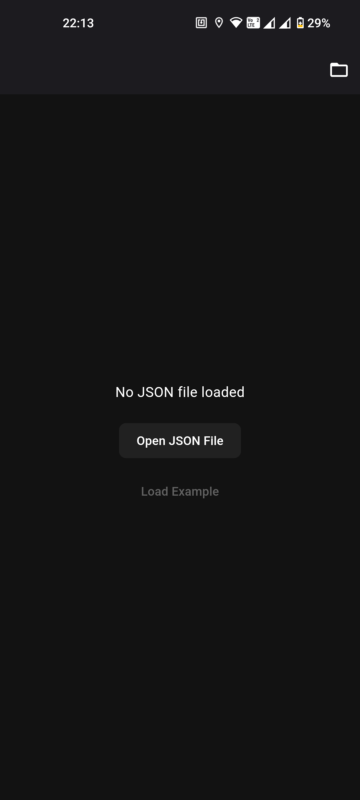
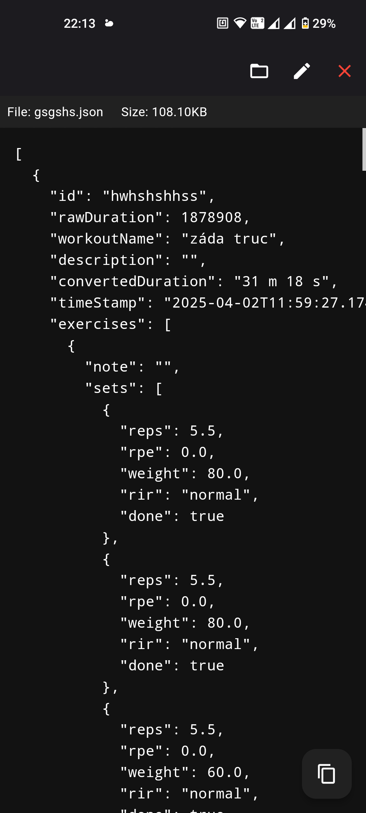
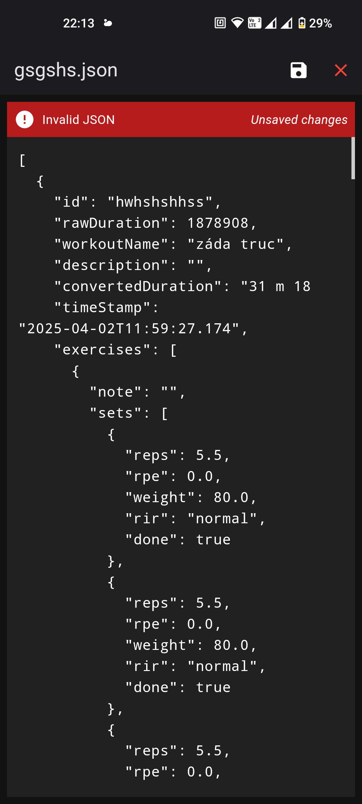

# 🧩 json_opener

**json_opener** is a lightweight and user-friendly application designed to help you **open, view, and edit JSON files**. It's perfect for developers, testers, and anyone who regularly works with JSON data.

## 🚀 Features

- 📂 Open local `.json` files
- ✍️ Edit JSON content in a clean interface
- ✅ Real-time JSON validation
- 💾 Save your changes changes 
- 🌓 Dark mode support (if available)

| Landing | Viewer | Editor |
|---------|--------|--------|
|  |  |  |

